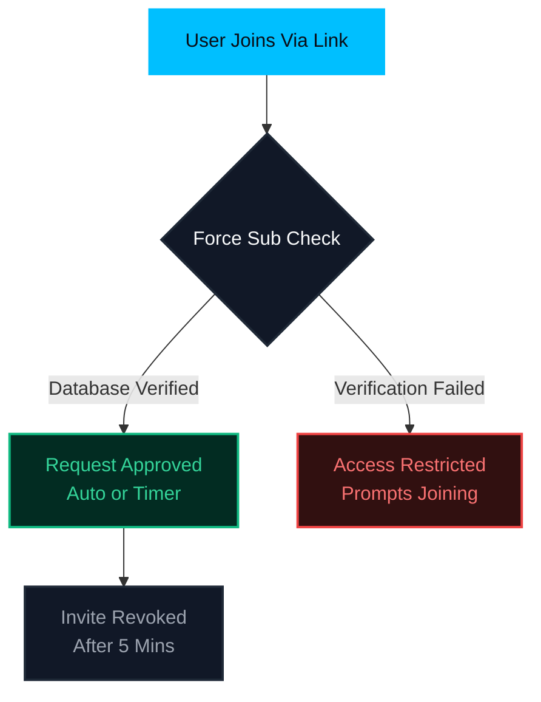

<p align="center">
  <a href="https://github.com/Unrated-Coder/Unrated-LinkShare-Bot" target="_blank">
    
  </a>
</p>

<p align="center">
  
</p>

<p align="center">
  <strong>An ultra-high-performance, native Telegram link sharing and channel management engine powered by Pyrofork.</strong>
</p>

<p align="center">
  <a href="https://t.me/Unrated_Coder"></a>
  <a href="https://t.me/Unrated_Coder"></a>
  
  
</p>

<!-- Sleek Horizontal Navigation Menu (All Emojis Removed) -->
<p align="center">
  <a href="#overview">Overview</a> •
  <a href="#core-capabilities">Capabilities</a> •
  <a href="#system-workflow">Workflow</a> •
  <a href="#command-console">Console</a> •
  <a href="#environment-configuration">Configuration</a> •
  <a href="#local-installation">Installation</a> •
  <a href="#docker-deployment">Docker</a> •
  <a href="#instant-deployment">Deployment</a>
</p>

<hr style="border: 0; height: 1px; background: linear-gradient(to right, rgba(0, 191, 255, 0), rgba(0, 191, 255, 0.75), rgba(0, 191, 255, 0)); margin: 30px 0;" />

## Overview

**LinkShareBot** is an enterprise-grade, high-performance Telegram native automation assistant designed to manage, store, and distribute Telegram channel links seamlessly. 

Powered by **Pyrogram**, it secures your community traffic by automatically generating, monitoring, and revoking invite links. It features advanced utilities like Force Subscription gating, bulk generation pipelines, and automated join-request approval engines.

---

## Core Capabilities

*   🌐 **Multi-Channel Indexing** — Register, monitor, and manage unlimited Telegram channels dynamically in a single unified database.
*   🔒 **Secure Auto-Invites** — Generate secure, custom single-use invite links on-the-fly to prevent unauthorized link sharing.
*   ⏱️ **Self-Revoking Links** — Enhanced link protection that automatically revokes and invalidates generated links after 5 minutes.
*   📦 **Bulk Generation** — Mass-generate custom invite links for multiple target channel IDs instantly in a single command execution.
*   📋 **Paginated Navigation** — Smooth, lag-free pagination using inline keyboards for effortless navigation through large channel lists.
*   🔄 **Request Queue Manager** — Direct support for Join Request links with automated request monitoring.
*   🛡️ **Force-Subscribe (FSub)** — Gate bot access by strictly requiring users to join your specified channels or request pools first.
*   📊 **Analytics Dashboard** — Live system diagnostics, total active users, and database analytics at your fingertips.

---

## System Workflow



---

## Command Console

<details>
<summary><b>📅 Channel & Link Management (Admins Only)</b></summary>
<br>

*   `/addch <channel_id>` — Registers a new target channel into the central database.
*   `/delch <channel_id>` — Removes a registered channel from the database.
*   `/channels` — Launches the paginated interactive channel list with inline navigation.
*   `/reqlink` — Displays active join-request links for connected channels.
*   `/links` — Outputs all generated active channels as clean list format.
*   `/bulklink <id1> <id2>` — Mass generates invite links for multiple channels instantly.

</details>

<details>
<summary><b>⏱️ Auto-Approval Engine</b></summary>
<br>

*   `/reqtime` — Sets the custom sleep delay before automatically approving join requests.
*   `/reqmode` — Toggles the Auto Request Approval system state [`ON` / `OFF`].
*   `/approveon` — Enables automated request approval for a specific channel.
*   `/approveoff` — Disables automated request approval for a specific channel.

</details>

<details>
<summary><b>🛡️ Force Subscription (FSub) Gate</b></summary>
<br>

*   `/add_fsub <channel_id> <mode>` — Configures a channel for Force-Sub (Modes: `normal`, `request`).
*   `/fsub` — Lists all channels currently active in the FSub gatekeeper.
*   `/del_fsub <channel_id>` — Disables FSub requirement for a channel.

</details>

<details>
<summary><b>📊 System & Admin Utilities (Admins Only)</b></summary>
<br>

*   `/stats` — Queries total active users, database rows, and subscription analytics.
*   `/status` — Queries live server metrics, CPU usage, RAM utilization, and uptime.
*   `/broadcast` — Dispatches a global push notification to all registered bot users.

</details>

---

## Environment Configuration

Configure the following environment variables inside your hosting platform settings or create a local `.env` file:

| Variable Name | Description / Value |
| :--- | :--- |
| `API_ID` | Your Telegram API ID obtained from [my.telegram.org](https://my.telegram.org) |
| `API_HASH` | Your Telegram API Hash obtained from [my.telegram.org](https://my.telegram.org) |
| `TG_BOT_TOKEN` | Your Telegram Bot Token obtained from [@BotFather](https://t.me/BotFather) |
| `OWNER_ID` | Telegram User ID of the primary bot owner |
| `ADMINS` | Space-separated list of authorized Admin User IDs (e.g., `123456 789012`) |
| `DB_URL` | MongoDB Connection URI string (e.g., `mongodb+srv://...`) |
| `DB_NAME` | MongoDB database name (defaults to `Links-Share` if not specified) |
| `DATABASE_CHANNEL` | Telegram Channel ID used for logging and database backups (e.g., `-100...`) |
| `PORT` | Web server port configuration (default: `8080` for Koyeb/Render binding) |

---

## Local Installation

Follow these steps to deploy a development instance of the bot locally:

### Prerequisites
- Python 3.10 or higher
- MongoDB (running instance)
- Git installed on your system

```bash
# 1. Clone the repository
git clone https://github.com/Unrated-Coder/Unrated-LinkShare-Bot.git
cd Unrated-LinkShare-Bot

# 2. Initialize a Python Virtual Environment
python3 -m venv venv
source venv/bin/activate  # On Windows, use: venv\Scripts\activate

# 3. Install required library dependencies
pip3 install -r requirements.txt

# 4. Configure environmental keys
cp sample_config.env .env  # Rename and configure values inside .env file

# 5. Start the engine
python3 -m bot
```

---

## Docker Deployment

For standardized production hosting, we highly recommend deploying via Docker containerization:

```bash
# Build the Docker image
docker build -t unrated-linkshare-bot .

# Run the container background daemon
docker run -d --name linkshare-bot --env-file .env unrated-linkshare-bot
```

---

## Instant Deployment

Deploy your custom instance of **LinkShareBot** directly to top cloud hosting platforms with a single click:

<p align="center">
  <a href="https://dashboard.heroku.com/new?template=https://github.com/Unrated-Coder/Unrated-LinkShare-Bot" target="_blank">
    
  </a>
  &nbsp;&nbsp;
  <a href="https://app.koyeb.com/deploy?type=git&repository=github.com/Unrated-Coder/Unrated-LinkShare-Bot&branch=main&name=unrated-linkshare-bot" target="_blank">
    
  </a>
  &nbsp;&nbsp;
  <a href="https://render.com/deploy?repo=https://github.com/Unrated-Coder/Unrated-LinkShare-Bot" target="_blank">
    
  </a>
</p>

---

<p align="center">
  Developed & maintained with ⚡️ by <a href="https://t.me/Unrated_Coder"><b>@Unrated_Coder</b></a> on Telegram
</p>
